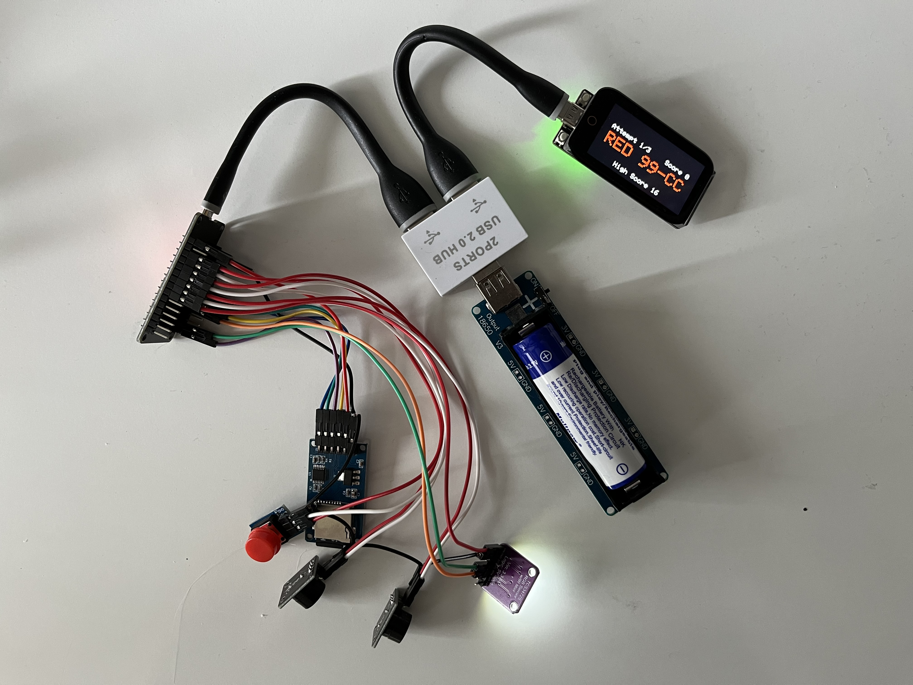
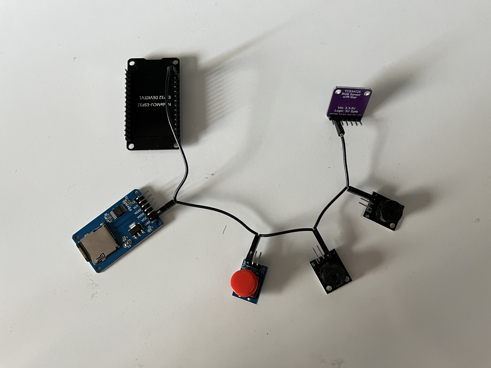
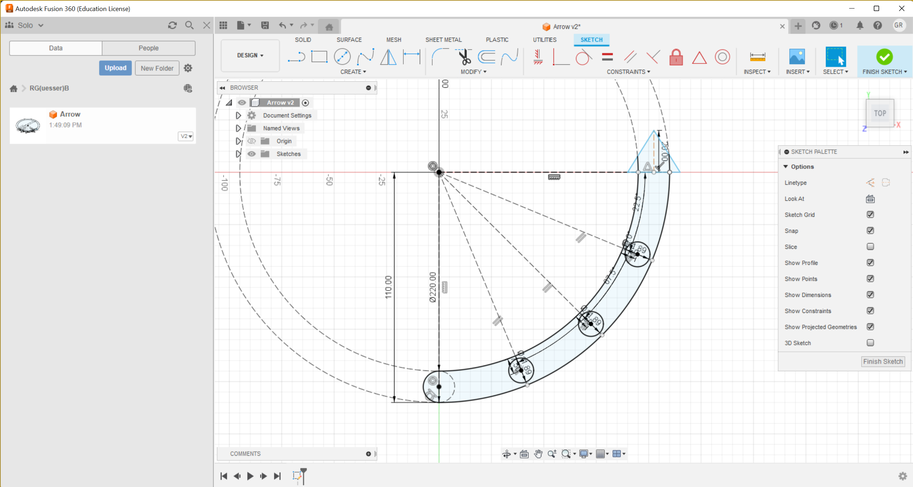
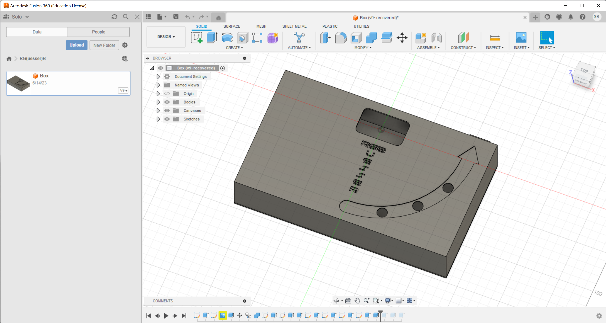

# Prelude

For the Portals of Perception exhibition, I worked on a retro-style computer game inspired by Asteroids and Simon (two classic late 70s/early 80s games, the former being an arcade video game and the latter being a toy of sorts). In this game, a spaceship (represented as a triangle) attached to a rope (represented as a line) anchored to an asteroid (represented as a circle) spun around the screen. In the first phase of the game, coloured orbs orbited around the asteroid and the player had to juggle between memorising the colours of the orbs in the correct order and avoiding the orbs by tugging on a cord—a conductive silicone tube to be exact—at the right time. In the second phase, coloured spikes slowly edged towards the centre of the screen, and the player had to shoot the spikes (using a button) following the order of colours they memorised in the previous phase. For example, if the first orb had been red and the second blue, the user first had to shoot the red spike and then the blue one. After the second phase was completed successfully, the game would go back to phase one, this time with a higher score, and the cycle would go on. If the player failed to avoid the orbs, shot the spikes in an incorrect order, or let the spikes reach the centre of the screen, the game ended. Otherwise, the game could go on indefinitely and the score would keep increasing. To enhance the retro feel of the game, I purchased an old CRT TV and a handful of adapters to display the game in a truly vintage format (rather than applying some filters to artificially introduce distortions). Following is a link to a video showing some selected clips and photographs of the game to help you visualise and/or remember it.

[https://drive.proton.me/urls/2DVAM5RK90#0G7I8L7JWh7B](https://drive.proton.me/urls/2DVAM5RK90#0G7I8L7JWh7B)

The reason I chose to make this game was twofold. Firstly, I wanted to pay tribute to some of the older games that no longer get the attention and recognition they deserve. Secondly, and most importantly, I aimed to explore the requirements of the present assignment.

“Using physical environmental design techniques, students should use iterative design to create an immersive computational environment.”

In my game, I considered the computational environment component to be the world I’d created (where a ship was floating through space, spinning endlessly while performing various manoeuvres to avoid getting destroyed), and the immersive component to be the controller, which required players to move their bodies (by performing tugging motions), thereby drawing them closer to the game’s universe. Together, the display and the controller—along with the chair placed in front of them, which deserves at least one mention—formed a physical environment which aimed to emulate a kind of control station.

As for the process I went through while creating the game, I took an iterative approach by building, testing, and rebuilding at every stage of development. When I was still considering various ideas for the game early on, I experimented with C++ and JavaScript, Unity and Unreal Engine, Arduino and ESP32. When I was finishing up the game, I played it at length myself (and set an undefeated high score as a result), but also had friends play it and provide feedback.

In the end, I reflected back to the process I went through in order to decide what I would make for the present assignment. While I enjoyed many aspects of working on Asterimon—that’s name of my Portals of Perception game—I wasn’t particularly fond of creating worlds through computer graphics. I wanted to work on a different kind of project next, but one which, despite being of a different nature, still fell under the requirements provided in the assignment brief. In order to better understand the space of possibilities available to me, I decided to explore the concepts of “computational environments” and “physical environment design” and work from there.

# Introduction

The term “computational environment” is defined by Butterfield et al. (2016) as “the environment (computer, system, subsystem, or network) in which [code] execution or computation takes place.” Prior to having come across this definition, I had quite a narrow conception of computational environments. While I’d never tried to define the term, I imagined it was more closely related to the term “environment” as used in physical contexts (such as classroom environments, where “environment” refers in part to tables, chairs, and so on). The discovery of this wide definition opened the door to many different possibilities; so many in fact, that I felt overwhelmed and couldn’t come up with ideas for my final project for some time. I kept the definition in mind while perusing the reading material for the IU000127 module.

I began developing an idea while reading Sicart’s (2014) _Play Matters_, in which the author writes: “a play space is a location specifically created to accommodate play […] playgrounds are the most typical play spaces, though the presence of toys in, for example, a doctor’s waiting room is an invitation for the child (and the parents) to appropriate that space through play, to turn it into a play space.” I liked the idea of turning an ordinary space (such as a doctor’s waiting room) into a play space. In the aforementioned example, it can be said that by introducing toys in a setting, a physical space is redesigned and therefore repurposed for play. This statement is valid if we take the verb “design” to mean “create or contrive for a particular purpose or effect” (The American Heritage Dictionary of the English Language, 2016)—in this case, the purpose or effect being inviting play—and “redesign” as the process of designing anew (from the “re-” prefix, signifying “again, anew” (The American Heritage Dictionary of the English Language, 2016)). With these definitions in mind, it can be said that the doctor’s waiting room example highlights a certain type of physical environment design; one that would eventually shape my final IU000127 project.

Another passage from the module’s reading material that inspired my work was from Macklin et al.’s (2016) _Games, Design and Play: A Detailed Approach to Iterative Game Design_. In this book, the authors write: “the more the designer opens up the ways a player sees and moves, the more complex the interpretation of the visual information becomes.” While this inconspicuous statement didn’t strike me as being particularly relevant at first, I remembered it while my final project idea was forming and it turned out to explain my later goals perfectly, as discussed further down.

The final event that led me to the idea I ended up pursuing for my final project occurred while I was working on a Photoshop project. As I tweaked the colours on my canvas, it occurred to me that while working with colours digitally, I only ever thought of them as a red component, a green component, and a blue component, rather than a united whole. On the other hand, I always thought of colours “in real life” as united wholes. I wondered if I could find a way to bridge the gap between these two forms of perception, perhaps by forcing myself to consider the red, green, and blue components of physical objects around me.

# Game Overview

RGB Guesser, alternatively spelled RG(uesser)B, is a game that aims to change players’ perception of colours around them. Players first place a battery in the RGB Guesser device, and then read the instructions on the screen. The instructions follow three formats, shown below.

*	RED NN-MM
*	GRN NN-MM
*	BLU NN-MM

“NN-MM” refers to a randomly generated range represented as two sets of repeating hexadecimal digits that cover 20% of the 0-255 range. As a reminder, in the typical RGB24 format, the red, green, and blue components each have a value between 0 and 255. A concrete example of an “NN-MM” range is 99-CC, which translates to 153-204 in decimal, covering 51 numbers in total (51 being 20% of 255). Based on the instruction, the player either has to find an object that has a red value within the given range, a green one, or a blue one (you can easily infer which instruction corresponds to which colour). Instructions follow a repeating red-green-blue sequence as the player progresses. Players have three attempts per instruction, after which the score resets.

Playing this game forces players to think of colours in a more scientific and less intuitive way, which is not only fun but also educational, considering many people are unaware of how colour works. The game was intentionally made to be battery-powered to allow users to turn any space into a sort of play space. Note that it may not technically be a play space, since Sicart (2014) explains that play spaces do “not impose any particular type of play, set of activities, purpose, or goal or reward structure.” Rather, RGB Guesser allows players to turn any space into a _playful_ space, which is analogous to a play space.

Following is a link to a video showing the game in action. Hopefully, this video can give you a sense of how it works. _Please note that the appearance of the 00-33 range three times during the video is purely coincidental. You can check the code—the numbers are generated randomly. The ranges are usually far more varied._

[https://drive.proton.me/urls/47RB1DTM5G#uXwGOMtRNTbt](https://drive.proton.me/urls/47RB1DTM5G#uXwGOMtRNTbt) _This is a download-only link. The size of the video is 156MB._

# Game Specifications

RGB Guesser was built with the following parts. I included links to the exact listings I got the parts from in the list below where possible.

* [LilyGO T-Display-S3 Touch](https://www.ebay.co.uk/itm/325563154933)
* NodeMCU-ESP32 ESP32 DEVKITV1
* [TCS34725 RGB Colour Sensor Module](https://www.ebay.co.uk/itm/203967560618)
* [Push Button Module](https://www.ebay.co.uk/itm/263210582254)
* [Passive Buzzer Module (x2)](https://www.ebay.co.uk/itm/262483857554)
* [Micro SD Card Module](https://www.amazon.co.uk/gp/product/B08P5JJDZK/ref=ppx_yo_dt_b_asin_title_o00_s00?ie=UTF8&psc=1)
* [32GB Micro SD Card](https://www.ebay.co.uk/itm/165332603958?var=464879519500)
* [DIY Dupont Wire Kit](https://www.ebay.co.uk/itm/264835199977)
* [Female to Female Dupont Wires](https://www.ebay.co.uk/itm/134415494864?var=433879423727)
* [Battery Shield](https://www.ebay.co.uk/itm/314099424441?var=612757828765)
* 3.7V 3500mAh 18650 Rechargeable Li-ion Battery
* [USB Splitter Adapter (1 Male to 2 Female)](https://www.amazon.co.uk/dp/B09DSD6DBY?psc=1&ref=ppx_yo2ov_dt_b_product_details)
* [0.5ft Micro USB Cable](https://www.amazon.co.uk/dp/B01EWA808M?psc=1&ref=ppx_yo2ov_dt_b_product_details)
* [0.5ft USB Type C Cable](https://www.amazon.co.uk/dp/B01M35SNME?psc=1&ref=ppx_yo2ov_dt_b_product_details)
* [eSUN Matte PLA Filament (White, 1.75mm)](https://www.amazon.co.uk/gp/product/B0B934KTP5/ref=ppx_yo_dt_b_asin_title_o06_s00?ie=UTF8&psc=1)
* [TINMORRY Silk Tri-Color PLA Filament (Red/Green/Blue, 1.75mm)](https://www.amazon.co.uk/gp/product/B0BDSN68LH/ref=ppx_yo_dt_b_asin_title_o04_s01?ie=UTF8&psc=1)

In addition to these components, which form the main body of the device, the following tools and supplies were used in construction.

*	Soldering Gun
*	Solder Wire
*	Soldering Helper Hands
*	2-in-1 Wire Stripper and Crimping Tool
*	Creality Ender-3 V2 Neo 3D Printer
*	Deburring Tool
*	Hot Glue Gun
*	Hot Glue Sticks
*	Super Glue

All modules are connected to the NodeMCU-ESP32 ESP32 DEVKITV1 via Dupont wires. This microcontroller board handles most of the I/O: handling button pushes, reading colour values, playing sound effects, and reading/writing the high score from/to the Micro SD card. The latter features warrants some additional comments. While the NodeMCU-ESP32 ESP32 DEVKITV1 has persistent flash memory, I wanted to store the high score in an external medium, since I’ve broken microcontroller boards in the past and figured it would be a safer means of storage.

The LilyGO T-Display S3 Touch handles the display, where users can read instructions and keep track of their current attempt and score as well as the high score (as shown in the previously mentioned video). This device and that discussed in the previous paragraph communicate via the ESP-NOW protocol.

Following is a photograph of the bare components of RGB Guesser, included here to give you a sense of the relative complexity of its hardware configuration.

You may be wondering how, if the components are connected via Dupont wires, a soldering iron was involved in the making of RGB Guesser. The NodeMCU-ESP32 ESP32 DEVKITV1 only has two ground pins, which are not enough to accommodate all the modules mentioned above directly. Therefore, I had to make my own daisy chain compound ground wire, shown below. (Making one’s own Dupont wires requires soldering and crimping.)

RGB Guesser’s hardware is enclosed within a 3D-printed box of my own design. Most of the box was printed with a tri-coloured filament with red, green, and blue PLA, which I picked due to the nature of the game (which involves guessing red, green, and blue values). Other colours can be seen on the box, which are a result of the red, green, and blue mixing together (in addition to the white arrow, which was printed with white PLA). Below are some screenshots that show the box’s design in Autodesk Fusion 360 (the software I used to design it). The total printing time of the box was 56 hours and 37 minutes.

# Challenges I Encountered

While working on this project, I encountered a number of challenges. The usual struggles involved in this kind of projects occurred—bad wiring, faulty logic, and so on—but won’t be discussed much here. Instead, I’d like to focus on some of the stranger challenges I had to deal with.

In the code for the LilyGO T-Display-S3 Touch, I wrote a function called getNextColor which returns the next colour in the repeating red-green-blue sequence. Originally, I manually set the colour to red during setup and called getNextColor with the false argument subsequently, which should have returned green, blue, red, green, blue, and so on, until the player lost the game (at which point the sequence would reset). However, the sequence would actually turn out to be red, blue, red, green, blue, and so on, skipping the first instance of green. I checked my code time and time again and couldn’t find any errors, but switching to a getNextColor(true) call instead of manually setting the first colour to red (where the true argument causes the sequence to reset) solved the problem.

Later, my NodeMCU-ESP32 ESP32 DEVKITV1 started crashing unexpectedly, and while debugging my code, I realised that this was caused by a mysterious byte of unknown origin (which I nicknamed the “ghost byte”) being sent to it. Once again, I checked my code numerous time but couldn’t find the issue, eventually hard-coding a feature to ignore this first byte.

Later, I had some issues with the scoring system (though this time I was able to spot a mistake of my own making), and programmed a function that flashed the current score on the screen every time it changed (this was before I implemented a permanent score tracker). This is when I realised what caused the previous bugs. Before any components of the game were loaded, a random value flashed on the screen, indicating that the function was called before any of the code I wrote. After performing some further experiments and setting “traps” for the code (dummy values which should have changed at a predictable rate, but didn’t), I realised that the firmware of the LilyGO T-Display-S3 indeed ran some functions before my own code even began. Some further adjustments in the code prevented this strange behaviour from causing any more problems.

This kind of issues, while rare, are the most difficult and frustrating to fix, and only represent a small fraction of the bugs I had to fix.

# Closing Remarks

I realise that, by using neither Unity nor Unreal Engine in my final project, I took a risk. However, I ask that you (the marker) carefully consider the introduction I wrote above—where I explain exactly how my project meets the criteria for the present assignment—and the fact that my work is rooted in the theory explored in the IU000127 module. In addition, I ask that you consider the countless hours that went into writing _over a thousand lines_ of code for both Asterimon and RGB Guesser, never mind the time spent on wiring up hardware, and the _hundreds_ of pounds spent on equipment.

# Disclaimer

All code found in this repository (within /src directories) was written by myself unless otherwise specified. Some of the code has inevitably appeared elsewhere (for example, generic code to initialise variables from third-party libraries), but where this applies, this is not the result of rote-copying. Following is a list of the GitHub repositories where I found all third-party libraries used in the _final_ code of RGB Guesser.

[https://github.com/Xinyuan-LilyGO/T-Display-S3](https://github.com/Xinyuan-LilyGO/T-Display-S3)

[https://github.com/hammikb/ESP32-Buzzer](https://github.com/hammikb/ESP32-Buzzer)

[https://github.com/adafruit/Adafruit_TCS34725](https://github.com/adafruit/Adafruit_TCS34725)

[https://github.com/adafruit/Adafruit_BusIO](https://github.com/adafruit/Adafruit_BusIO)

The font used on the RGB Guesser 3D-printed box is [https://www.dafont.com/moonhouse.font](Moonhouse).

# Reference List

Butterfield, A., Ngondi, G., and Kerr, A. (eds) (2016) _A Dictionary of Computer Science_. Oxford: Oxford University Press.

Macklin, C. and Sharp, J. (2016) _Games, Design and Play: A Detailed Approach to Iterative Game Design_. Boston: Addison-Wesley.

Sicart, M. (2014) _Play Matters_. Cambridge, Massachusetts: MIT Press.

_The American Heritage Dictionary of the English Language_ (2016) Boston: Houghton Mifflin Harcourt.
